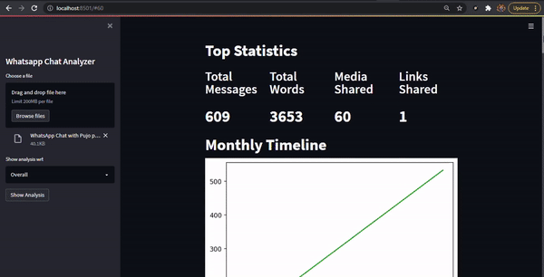
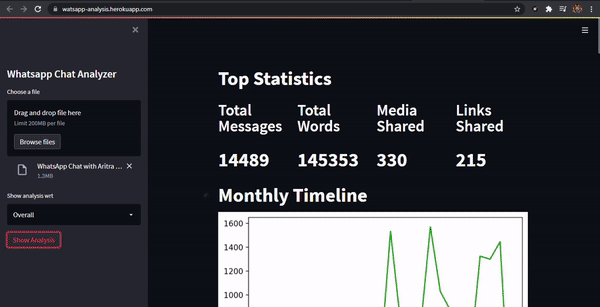

# Whatsapp Chat Analyzer (StreamLit)


## Software

##### PyCharm


## Packages 

##### 1) Streamlit
##### 2) Matplotlib
##### 3) Seaborn
##### 4) Urlextract
##### 5) Wordcloud
##### 6) Pandas
##### 7) Emoji


  
## Features

#### Provides Visuals for the Following:
##### 1) Total Messages and Words
##### 2) Total Links and Media Shared
##### 3) Monthly Timeline - Whatsapp Activitiy
##### 4) Daily Timeline
##### 5) Most Busy Day and Month
##### 6) Weekly Activity Period
##### 7) Most Busy Users - In case of Whatsapp Groups
##### 8) Most Common Words
##### 9) Emoji Usage

## To Run & Deploy The Project

```bash
  Import all the files to your Project Directory
```
```bash
  Install all the Required Packages from the Pycharm Project Interpreter
```
```bash
  First try running the file locally by typing the following in Pycharm Terminal:
  'streamlit run app.py'
```
```bash
  Next, Create a Github & Heroku Account
```
```bash
  Now, Create a new Github Repository and push the project into it by typig the following set of commands into the Pycharm Terminal:
  'git init'
  'git add README.md'
  'git commit -m "Committed"'
  'git branch -M master'
  'git remote add origin https://github.com/your_username/your_repo_name.git'
  'git push -u origin master'
```
```bash
  Finally, its time to push our files to Heroku and Run our app live. To do so type the follwing set of commands sequentially:
  'heroku login (Enter your Login Details once the Web Browser prompt opens)'
  'heroku create "Any app name you want to give"'
  'git push heroku master'
  
  Once executed you will get a link for the app. Run the app through that Link!! :)
```


## Demo





## Live Server

https://watsapp-analysis.herokuapp.com/
